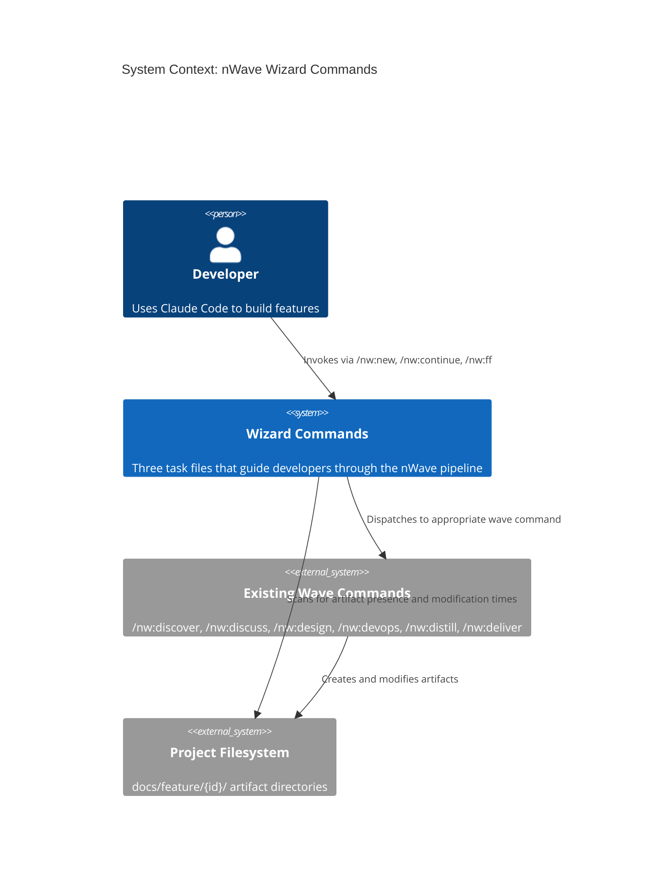
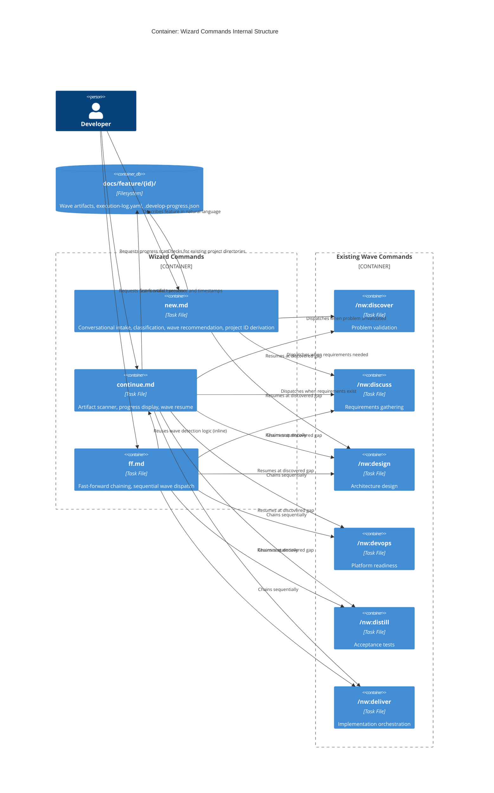

# Architecture Design: Wizard Commands

**Feature**: wizard-commands
**Date**: 2026-02-21
**Status**: Draft
**Author**: Morgan (nw-solution-architect)

## System Context

The wizard commands add three entry points (`/nw:new`, `/nw:continue`, `/nw:ff`) that externalize the nWave wave pipeline model. They run as the main Claude Code instance reading markdown task files -- no new agents, no new Python code.

### Quality Attribute Priorities

| Priority | Attribute | Rationale |
|----------|-----------|-----------|
| 1 | Maintainability | Task files must stay consistent with evolving wave commands |
| 2 | Usability | Primary goal is reducing user friction |
| 3 | Reliability | Wave detection must be accurate or users lose trust |
| 4 | Simplicity | Markdown task files, no runtime dependencies |

### Constraints

- No new agents -- all three commands run as main Claude instance
- No new Python code -- commands are markdown task files only
- No changes to existing wave commands
- Must follow existing frontmatter format (`description`, `argument-hint`, `disable-model-invocation`)
- Wave detection is filesystem-based (artifact file presence)

## C4 System Context (L1)



## C4 Container (L2)



## Component Architecture

### Component 1: `/nw:new` (new.md)

**Responsibility**: Conversational feature intake wizard

**Behavior flow**:
1. Ask user to describe their feature in natural language
2. If description is vague (< 10 meaningful chars or unclassifiable), ask follow-up questions: what system, what problem, who benefits
3. Derive project ID: strip prefixes (implement, add, create, build), remove stop words (a, the, to, for, with, and), kebab-case, max 5 segments
4. Show derived ID, allow override
5. Check `docs/feature/{id}/` for name conflicts -- offer continue/rename/archive
6. Ask clarifying questions: new vs existing behavior, requirements readiness
7. Classify feature type: user-facing, backend, infrastructure, cross-cutting
8. Scan `docs/feature/{id}/` for existing artifacts (greenfield vs brownfield detection)
9. Apply recommendation logic (see Recommendation Engine below) to determine starting wave
10. Show recommendation with rationale, get user confirmation
11. Dispatch to `/nw:{wave}` with project ID and configuration

**Dispatches to**: Any of the 6 wave commands
**Reads from filesystem**: `docs/feature/` directory listing, artifact file presence

### Component 2: `/nw:continue` (continue.md)

**Responsibility**: Progress scanner and wave resume

**Behavior flow**:
1. Scan `docs/feature/` for project directories
2. If none found: display message, suggest `/nw:new`
3. If multiple: list by last modification timestamp (most recent file under each project tree), prompt selection
4. For selected project, check each wave's required artifacts (see Wave Detection Rules)
5. Detect anomalies: empty files (0 bytes), non-adjacent artifacts (skipped waves)
6. Display per-wave progress: complete / in progress / not started
7. For DELIVER in progress: read `execution-log.yaml` for step-level detail (completed steps, next step)
8. Recommend next wave, get user confirmation
9. Dispatch to `/nw:{wave}` with project ID

**Dispatches to**: Any of the 6 wave commands
**Reads from filesystem**: `docs/feature/` tree, artifact files, `execution-log.yaml`, `.develop-progress.json`

### Component 3: `/nw:ff` (ff.md)

**Responsibility**: Fast-forward wave chaining

**Behavior flow**:
1. Accept optional feature description and/or `--from={wave}` flag
2. If new feature (description provided, no existing project): derive project ID (same logic as `/nw:new`), confirm with user
3. If existing project: reuse wave detection logic from `/nw:continue` to determine current progress
4. Determine remaining wave sequence (default order: DISCUSS > DESIGN > DEVOPS > DISTILL > DELIVER; DISCOVER skipped by default)
5. If `--from={wave}` provided: validate prerequisite artifacts exist, start from that wave
6. Show planned wave sequence, ask for one-time confirmation
7. Chain waves sequentially: dispatch each via its `/nw:{wave}` command, wait for completion, verify output artifacts, proceed to next
8. On failure: stop immediately, display error, suggest `/nw:continue` for manual resume

**Dispatches to**: Wave commands in sequence (DISCUSS through DELIVER)
**Reads from filesystem**: Same as `/nw:continue` plus ongoing artifact verification between waves

## Wave Detection Rules (Shared Logic)

This logic is embedded inline in both `continue.md` and `ff.md` (not extracted to a separate file, since these are markdown instructions for the Claude instance to follow).

| Wave | Status: Complete | Status: In Progress |
|------|-----------------|---------------------|
| DISCOVER | `docs/discovery/problem-validation.md` AND `docs/discovery/lean-canvas.md` exist and are non-empty | `docs/discovery/` directory exists but required files missing or empty |
| DISCUSS | `docs/feature/{id}/discuss/requirements.md` AND `docs/feature/{id}/discuss/user-stories.md` exist and are non-empty | `docs/feature/{id}/discuss/` exists but required files missing or empty |
| DESIGN | `docs/feature/{id}/design/architecture-design.md` exists and is non-empty | `docs/feature/{id}/design/` exists but required file missing or empty |
| DEVOP | `docs/feature/{id}/deliver/platform-architecture.md` exists and is non-empty | `docs/feature/{id}/deliver/` exists but platform-architecture.md missing or empty |
| DISTILL | `docs/feature/{id}/distill/test-scenarios.md` exists and is non-empty | `docs/feature/{id}/distill/` exists but required file missing or empty |
| DELIVER | `docs/feature/{id}/execution-log.yaml` with all roadmap steps at COMMIT/PASS | `execution-log.yaml` exists with some steps incomplete |

"Not started" = neither directory nor artifacts exist for that wave.

## Recommendation Engine (/nw:new)

Decision tree applied after classification and artifact scan:

```
IF no prior artifacts exist:
    IF user has not validated the problem space:
        -> DISCOVER ("Validate the problem first")
    ELSE IF user has clear requirements in their head:
        -> DISCUSS ("Formalize requirements into user stories")
    ELSE:
        -> DISCUSS ("Define requirements and acceptance criteria")

IF prior artifacts exist for project {id}:
    IF DISCUSS complete AND no DESIGN:
        -> DESIGN ("Requirements ready, design the architecture")
    IF DESIGN complete AND no DEVOP:
        -> DEVOP ("Architecture ready, prepare platform")
    IF DEVOP complete AND no DISTILL:
        -> DISTILL ("Platform ready, create acceptance tests")
    IF all prior waves complete:
        -> DELIVER ("Ready for implementation")
```

## Command Dispatch Pattern

All three wizard commands dispatch to wave commands using the same pattern established by `/nw:deliver`:

1. The wizard (running as main Claude instance) determines the target wave command
2. It invokes the wave command by reading the corresponding task file and following its instructions
3. For `/nw:new` and `/nw:continue`: single dispatch (one wave at a time)
4. For `/nw:ff`: sequential dispatch (chain of waves, each completing before the next starts)

The dispatch uses the existing `/nw:{wave}` command invocation -- the wizard does not use the Task tool to invoke subagents for the wizard logic itself. It uses the Task tool only when the target wave command requires subagent dispatch (as `/nw:deliver` does internally).

## Task File Convention Compliance

Each new task file follows the established frontmatter format:

```yaml
---
description: "..."
argument-hint: "..."
disable-model-invocation: true  # Present on new.md and continue.md (wizard runs as main instance)
---
```

Body structure follows the existing pattern observed across all task files:
- Title with wave/command name
- Overview section
- Behavior flow (numbered steps)
- Error handling
- Success criteria (checkbox list)
- Examples

## Integration Points

| Integration Point | Direction | Contract |
|-------------------|-----------|----------|
| `/nw:new` -> wave commands | Outbound | Passes project ID as argument, configuration via described parameters |
| `/nw:continue` -> wave commands | Outbound | Passes project ID as argument |
| `/nw:continue` -> execution-log.yaml | Inbound (read) | Reads YAML, checks step statuses for COMMIT/PASS |
| `/nw:continue` -> .develop-progress.json | Inbound (read) | Reads JSON, checks last failure point |
| `/nw:ff` -> wave commands | Outbound | Sequential dispatch with project ID, verifies output artifacts between waves |
| All wizards -> docs/feature/ | Inbound (read) | Filesystem scan for directories and file presence |

## Error Handling Strategy

| Error Case | Handler | Response |
|------------|---------|----------|
| Vague description | `/nw:new` | Ask 3 follow-up questions with example |
| Name conflict | `/nw:new` | Offer continue/rename/archive options |
| No projects found | `/nw:continue` | Suggest `/nw:new` |
| Empty/corrupted artifact | `/nw:continue` | Flag file, recommend re-running wave |
| Skipped waves (non-adjacent) | `/nw:continue` | Warn, offer gap-fill/continue/review |
| Wave failure during ff | `/nw:ff` | Stop pipeline, show error, suggest `/nw:continue` |
| Missing prerequisites for --from | `/nw:ff` | List missing artifacts, refuse to proceed |

## Deployment Architecture

No deployment concerns -- these are markdown files added to the `nWave/tasks/nw/` directory. They are loaded by Claude Code's task file mechanism at invocation time.

**New files created**:
- `nWave/tasks/nw/new.md`
- `nWave/tasks/nw/continue.md`
- `nWave/tasks/nw/ff.md`

**Existing files modified**: None.

## Quality Attribute Strategies

| Attribute | Strategy |
|-----------|----------|
| Maintainability | Wave detection rules documented inline with exact file paths; adding a new wave requires updating the detection table in continue.md and ff.md |
| Usability | Conversational flow with rationale shown at every decision point; user confirms before dispatch |
| Reliability | Empty-file detection (0 bytes check), non-adjacent wave warning, prerequisite validation for --from flag |
| Consistency | Project ID derivation logic matches existing deliver.md; frontmatter format matches all existing task files |
