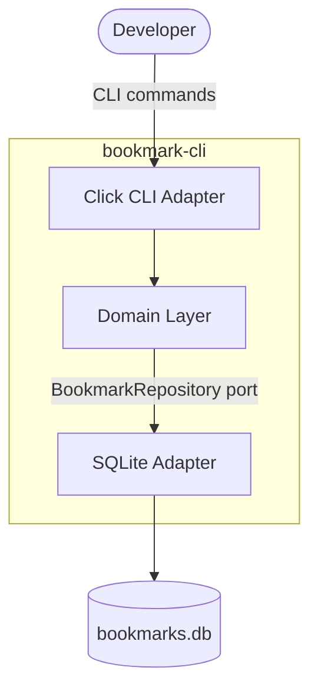

# Tutorial: Architecture Design

**Time**: ~15 minutes (9 steps)
**Platform**: macOS or Linux (Windows: use WSL)
**Prerequisites**: Python 3.10+, Claude Code with nWave installed, [Tutorial 6](../tutorial-discuss/) completed
**What this is**: An interactive walkthrough of `/nw-design` and `/nw-diagram` -- nWave's architecture design commands. You will turn requirements into a technical architecture with visual diagrams.

---

## What You'll Build

A complete architecture package for the bookmark CLI -- component boundaries, technology decisions, and visual diagrams.

**Before**: You have validated requirements from Tutorial 6 (user stories, acceptance criteria, UX journey) in `docs/feature/bookmark-cli/discuss/`. But you have no architecture, no technology decisions, and no component design.

**After**: You have an architecture document defining how the bookmark CLI is structured (domain layer, CLI adapter, storage adapter), ADRs explaining each technology choice, and Mermaid diagrams you can render in any markdown viewer. Architecture lives in `docs/product/architecture/` (SSOT) with feature-specific deltas in `docs/feature/bookmark-cli/design/`.

**Why this matters**: Jumping from requirements to code skips the question "how should the pieces fit together?" `/nw-design` answers that question with documented decisions and visual diagrams, so the DISTILL and DELIVER waves have clear boundaries to work within.

---

## Step 1 of 9: Confirm Your Starting Point (~1 minute)

You should be in the `bookmark-cli` project from Tutorial 6, with requirements artifacts committed.

Verify:

```bash
ls docs/feature/bookmark-cli/discuss/user-stories.md
```

You should see:

```
docs/feature/bookmark-cli/discuss/user-stories.md
```

Check that your requirements include user stories:

```bash
head -5 docs/feature/bookmark-cli/discuss/user-stories.md
```

You should see the beginning of your user stories file from Tutorial 6 (content varies based on your discuss session).

> **If `docs/feature/bookmark-cli/discuss/` does not exist**: Complete [Tutorial 6](../tutorial-discuss/) first. This tutorial builds directly on its output.

*Next: you will launch the design command and answer architecture questions.*

---

## Step 2 of 9: Launch the Design Session (~2 minutes)

Open Claude Code if it is not already running:

```bash
claude
```

Start the architecture design:

```
/nw-design bookmark-cli
```

> **AI output varies between runs.** Your conversation with the architect will differ from the examples below. That is expected -- the architect adapts to your requirements and codebase. What matters is the structure (decisions, architecture document, diagrams), not the exact wording.

`/nw-design` starts with two routing decisions before design begins:

**Decision 1: Design scope** -- What are you designing?

| Option | When to pick | Architect |
|--------|-------------|-----------|
| System / infrastructure | Distributed systems, scalability, caching | Titan (`@system-designer`) |
| Domain / bounded contexts | DDD, aggregates, Event Modeling, event sourcing | Hera (`@ddd-architect`) |
| **Application / components** | Component boundaries, hexagonal architecture, ADRs | Morgan (`@solution-architect`) |
| Full stack | All three in sequence | All three architects |

For a CLI tool like bookmark-cli, pick **Application / components**. This routes to Morgan.

**Decision 2: Interaction mode** -- How do you want to work?

| Option | When to pick |
|--------|-------------|
| **Guide me** | You want to make decisions together through Q&A |
| Propose | You want the architect to analyze and present options with trade-offs |

Pick **Guide me** for this tutorial so you can see the decision process.

After these two routing decisions, Morgan asks four architecture decisions. Give these answers:

| Question | Answer | Why |
|----------|--------|-----|
| Architecture style? | **Hexagonal** | Clean separation between domain logic and I/O |
| System design approach? | **Monolithic** | This is a CLI tool, not a distributed system |
| Communication pattern? | **Synchronous** | CLI commands run sequentially |
| Data architecture? | **Single Database** | One SQLite file is all we need |

<details>
<summary>What are the other options?</summary>

Each question has alternatives you might choose for different projects:

- **Architecture style**: Layered (simple top-down layers), Clean Architecture (similar to hexagonal with different terminology), Ports-and-Adapters (another name for hexagonal)
- **System design**: Microservices (distributed independent services), Modular Monolith (single deployment with strict module boundaries), Serverless (cloud function-based)
- **Communication**: Asynchronous (message/event-driven), Hybrid (mix of sync and async)
- **Data architecture**: Database-per-Service (each service owns its data), Event Store (append-only event log), CQRS (separate read/write models)

For a CLI tool, the simple options above are the right choices. These alternatives matter more for distributed systems or complex backends.
</details>

**What just happened?** `/nw-design` routed you to Morgan (application scope) in guided mode. Morgan then asked four foundational architecture decisions. For a CLI tool, the simplest options (hexagonal monolith, synchronous, single database) are the right choices.

*Next: Morgan will analyze your codebase and design the architecture.*

---

## Step 3 of 9: Watch the Design Process (~3 minutes)

After your answers, Morgan works through several phases. You will see them scroll by as a continuous flow:

```
Searching existing codebase for related functionality...
  Glob: **/*.py -- found 0 existing modules
  Grep: "bookmark" -- no existing implementations
Existing system analysis: greenfield project, no reuse opportunities.

Designing component architecture...
  Creating docs/feature/bookmark-cli/design/architecture-design.md
  Creating docs/feature/bookmark-cli/design/component-boundaries.md
  Creating docs/feature/bookmark-cli/design/technology-stack.md

Writing Architecture Decision Records...
  Creating docs/adrs/ADR-001-hexagonal-architecture.md
  Creating docs/adrs/ADR-002-sqlite-storage.md
  Creating docs/adrs/ADR-003-click-cli-framework.md

Invoking peer review (Atlas)...
Review result: APPROVED
- Component boundaries: clear separation
- Technology choices: justified with alternatives
- ADR quality: meets MADR template
```

The design process has four phases: **codebase analysis** (check what exists), **architecture design** (write the documents), **ADR creation** (record each decision), and **peer review** (automated quality check). You do not need to intervene -- just watch them complete.

> **If the reviewer finds issues**: Morgan fixes them automatically. This may take 1-2 iterations. You do not need to intervene unless Morgan asks a question.

### Messages you can safely ignore

Lines containing `PreToolUse` or `DES_MARKERS` are internal quality gates -- normal operation, not errors.

**Verify the design completed** by checking that the architecture directory was created:

```bash
ls docs/feature/bookmark-cli/design/
```

You should see files like:

```
architecture-design.md
component-boundaries.md
technology-stack.md
data-models.md
```

> **If the directory is empty or does not exist**: The design session may still be running. Wait for Morgan to finish, or check the Claude Code output for errors.

*Next: you will explore the hexagonal architecture Morgan designed.*

---

## Step 4 of 9: Understand the Hexagonal Architecture (~2 minutes)

Check what Morgan created:

```bash
ls docs/feature/bookmark-cli/design/
```

You should see:

```
architecture-design.md
component-boundaries.md
technology-stack.md
data-models.md
```

> **Your file names may differ slightly.** Morgan names files based on your specific design. The pattern `docs/feature/{name}/design/*.md` is what matters.

Look at the component boundaries:

```bash
head -40 docs/feature/bookmark-cli/design/component-boundaries.md
```

You will see something like:

```markdown
# Component Boundaries

## Domain Layer (bookmark_cli.domain)
- Bookmark entity: URL, title, tags, created_at
- SearchService: keyword matching across URLs, tags, titles
- TagManager: tag normalization and validation

## Port Interfaces (bookmark_cli.ports)
- BookmarkRepository (driven port): save, find_by_id, search
- CLIPresenter (driving port): format output for terminal

## Adapters (bookmark_cli.adapters)
- SQLiteRepository implements BookmarkRepository
- ClickCLI implements CLIPresenter
```

**What just happened?** Morgan designed a hexagonal architecture with three layers. The **domain** holds your business logic (bookmarks, search, tags) with zero knowledge of storage or CLI frameworks. **Ports** are interfaces the domain exposes or depends on. **Adapters** are concrete implementations (SQLite, Click) that plug into those ports. This means you can swap storage or CLI framework without changing domain logic.

*Next: you will explore the decision records that justify each technology choice.*

---

## Step 5 of 9: Explore the Decision Records (~1 minute)

Check the ADRs:

```bash
ls docs/adrs/
```

You should see 2-4 ADR files. Open one:

```bash
head -30 docs/adrs/ADR-001-hexagonal-architecture.md
```

Each ADR follows a standard template: **Status**, **Context**, **Decision**, **Alternatives Considered**, **Consequences**. This is your decision record -- if someone asks "why hexagonal?" six months from now, the answer is documented.

> **If `docs/adrs/` does not exist**: Morgan may have placed ADRs inside `docs/feature/bookmark-cli/design/`. Check there instead.

*Next: you will generate visual architecture diagrams.*

---

## Step 6 of 9: Generate Architecture Diagrams (~2 minutes)

With the architecture defined, generate visual diagrams:

```
/nw-diagram bookmark-cli --format=mermaid --level=container
```

Morgan reads the architecture documents and produces Mermaid diagrams. You will see:

```
Generating diagrams from architecture documents...
  Creating docs/feature/bookmark-cli/design/diagrams/system-context.md
  Creating docs/feature/bookmark-cli/design/diagrams/component-architecture.md
```

> **Your file names and count may differ.** Morgan generates diagrams based on the complexity of your architecture. A simple CLI tool typically gets 2-3 diagrams.

Open the component diagram:

```bash
cat docs/feature/bookmark-cli/design/diagrams/component-architecture.md
```

You will see a Mermaid code block like:

````markdown

````

> **Copy only the lines between the triple backticks** (the `graph TD` block), not the surrounding markdown fencing. The ```` ```mermaid ```` and ```` ``` ```` lines are markdown syntax that tells renderers to treat the content as a diagram -- they are not part of the diagram itself.

> **Your diagram will differ.** Morgan generates diagrams from your specific architecture. The structure (user, adapters, domain, storage) is what matters, not exact node names.

To render the diagram, paste the Mermaid block into any Mermaid-compatible viewer:
- **GitHub**: Mermaid renders automatically in `.md` files
- **VS Code**: Install the "Mermaid Preview" extension
- **Online**: Paste at [mermaid.live](https://mermaid.live)

**What just happened?** `/nw-diagram` read the architecture documents from the design phase and produced visual representations. The diagrams follow the C4 model: context (who uses the system), container (major components), and component (internal structure). You chose the container level, which shows how the CLI, domain, and storage relate.

> **If you see "No architecture documents found"**: Make sure Step 3 completed successfully. Run `/nw-design bookmark-cli` again if needed -- Morgan will pick up where it left off.

*Next: you will review all artifacts and commit them.*

---

## Step 7 of 9: Review and Commit Artifacts (~2 minutes)

Check the full artifact tree:

```bash
find docs/feature/bookmark-cli/design docs/adrs -type f 2>/dev/null | sort
```

You should see something like:

```
docs/adrs/ADR-001-hexagonal-architecture.md
docs/adrs/ADR-002-sqlite-storage.md
docs/adrs/ADR-003-click-cli-framework.md
docs/feature/bookmark-cli/design/architecture-design.md
docs/feature/bookmark-cli/design/component-boundaries.md
docs/feature/bookmark-cli/design/data-models.md
docs/feature/bookmark-cli/design/technology-stack.md
docs/feature/bookmark-cli/design/wave-decisions.md
```

> **Your file list will differ.** Count matters more than exact names. You should have: 1 architecture document, 1 component boundaries file, 1 technology stack file, 2+ ADRs, and 1+ diagrams.

Commit everything:

```bash
git add -A && git commit -m "docs: architecture design and diagrams from design session"
```

You should see:

```
[main ...] docs: architecture design and diagrams from design session
```

*Next: a recap of what you built and where it feeds into the next wave.*

---

## Step 8 of 9: What You Built (~1 minute)

You started with requirements and ended with a complete architecture package:

1. **Architecture and component boundaries** -- How the bookmark CLI is structured (domain, ports, adapters) with clear responsibilities for each layer
2. **Technology decisions (ADRs)** -- Decision records for architecture style, storage, and CLI framework, each with alternatives considered
3. **Visual diagrams** -- Mermaid diagrams showing system context and component architecture

### What You Didn't Have to Do

- Debate architecture patterns without context
- Research CLI frameworks and compare them manually
- Draw architecture diagrams from scratch
- Write ADRs in the correct template format
- Remember to document "alternatives considered"

*Next: see how this tutorial fits into the full wave pipeline.*

---

## Step 9 of 9: The Wave So Far (~30 seconds)

```
DISCOVER             DIVERGE              DISCUSS              DESIGN               DISTILL
(/nw-discover)       (/nw-diverge)        (/nw-discuss)        (/nw-design)         (/nw-distill)
────────────────     ────────────────     ────────────────     ────────────────     ────────────────
"Is the problem      "Which direction     "What should we      "How should we       "Generate test
 real?"               should we go?"       build?"              build it?"           specs"

Evidence-based       Design exploration   Journey + stories    Architecture +       Acceptance tests
validation           + recommendation     + acceptance         ADRs + diagrams      from requirements
                     (optional)           criteria                                  + architecture

Tutorial 4           Tutorial 5           Tutorial 6           This tutorial        Tutorial 8
```

Each wave builds on the previous one. The architecture document references your user stories. The component boundaries map to your acceptance criteria. Nothing is designed in a vacuum.

---

## Next Steps

- **[Tutorial 8: Generating Acceptance Tests](../tutorial-distill/)** -- Take your architecture into `/nw-distill` to auto-generate BDD acceptance tests from user stories and component boundaries
- **Read an ADR aloud** -- If the "Alternatives Considered" section explains why each was rejected, the ADR is well-written. If it just lists names without rationale, it needs more detail.
- **Render a diagram** -- Paste the Mermaid code into [mermaid.live](https://mermaid.live) and see the visual architecture. Share it with a teammate to validate the design.

---

## Troubleshooting

| Symptom | Fix |
|---------|-----|
| Morgan does not start after `/nw-design` | Make sure nWave is installed. Run `/nw-help` to verify. |
| Morgan skips the four decisions and designs immediately | Say `*design-architecture bookmark-cli` to explicitly start the interactive flow. |
| Peer review fails repeatedly | Say "let's simplify -- focus on the core components only." Fewer components are easier to validate. |
| No `docs/feature/bookmark-cli/design/` directory after the session | Morgan writes architecture artifacts after the four decisions. If you ended the session early, run `/nw-design bookmark-cli` again. |
| `/nw-diagram` says "No architecture documents found" | Run `/nw-design` first. Diagrams require the architecture documents as input. |
| Diagrams do not render | Verify the Mermaid syntax at [mermaid.live](https://mermaid.live). If it fails, the diagram file may have a formatting issue -- copy just the content between the triple backticks. |
| Want to start fresh | Delete `docs/feature/bookmark-cli/design/` and `docs/adrs/` and run `/nw-design bookmark-cli` again. |

---

**Last Updated**: 2026-04-06
