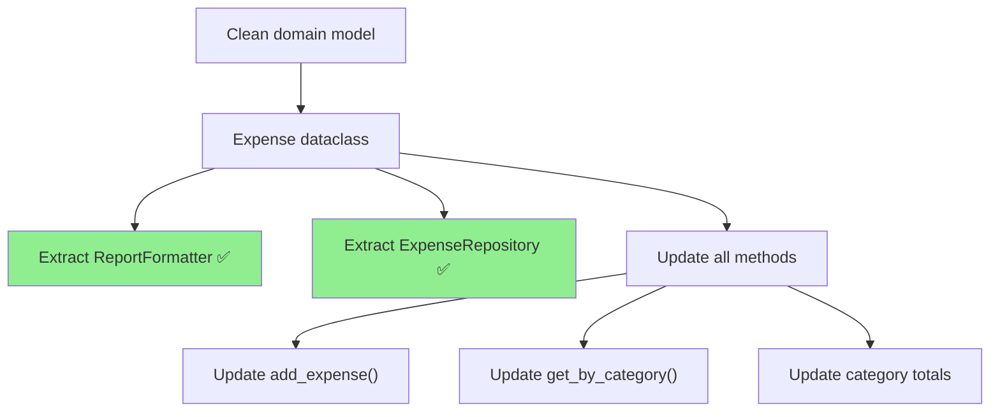

# Tutorial: Safe Refactoring with Mikado

**Time**: ~20 minutes (8 steps)
**Platform**: macOS or Linux (Windows: use WSL)
**Prerequisites**: Python 3.10+, Claude Code with nWave installed, [Tutorial 1](../tutorial-first-delivery/) completed
**What this is**: An interactive walkthrough of `/nw-refactor` and `/nw-mikado` -- nWave's safe refactoring commands. You will take a working but messy Python project and incrementally clean it up without breaking anything.

---

## What You'll Build

A cleanly refactored expense tracker -- extracted from a single messy file into focused, testable modules with zero test regressions along the way.

**Before**: A 90-line Python file with duplicated logic, a god class, hardcoded values, and no separation of concerns. It works, but every change risks breaking something else.

**After**: Clean modules with single responsibilities, no duplication, configurable values, and the same tests passing throughout. You will also have a Mikado dependency graph showing exactly which refactorings depend on which.

**Why this matters**: Refactoring messy code is risky. Change one thing, break three others. `/nw-refactor` analyzes your code and creates a safe, incremental plan. `/nw-mikado` maps dependencies between refactorings so you tackle them in the right order -- leaf-first, never breaking the build.

---

## Step 1 of 8: Create the Messy Starter Project (~2 minutes)

Create a new project directory and move into it:

```bash
mkdir expense-tracker && cd expense-tracker
```

Initialize it:

```bash
git init && python -m venv .venv && source .venv/bin/activate
pip install pytest --quiet
```

You should see:

```
Initialized empty Git repository in .../expense-tracker/.git/
```

Now create the source and test directories:

```bash
mkdir src tests
```

Create `src/expenses.py` with the code below (copy the entire block). This file works but has intentional code smells -- you will analyze them in Step 2:

```python
# src/expenses.py -- intentionally messy, do not clean up manually
import json
from datetime import datetime

class ExpenseManager:

    def __init__(self):
        self.expenses = []
        self.tax_rate = 0.21  # hardcoded tax rate
        self.currency = "USD"  # hardcoded currency

    def add_expense(self, amount, category, description=""):
        if amount <= 0:
            raise ValueError("Amount must be positive")
        if category not in ["food", "transport", "office", "other"]:
            raise ValueError("Invalid category")
        expense = {
            "amount": amount,
            "category": category,
            "description": description,
            "date": datetime.now().isoformat(),
            "amount_with_tax": round(amount * (1 + 0.21), 2),  # duplicated tax rate
        }
        self.expenses.append(expense)
        return expense

    def get_total(self):
        total = 0
        for e in self.expenses:
            total += e["amount"]
        return total

    def get_total_with_tax(self):
        total = 0
        for e in self.expenses:
            total += e["amount"] * (1 + 0.21)  # duplicated tax rate again
        return round(total, 2)

    def get_report(self):
        lines = []
        lines.append("=== Expense Report ===")
        lines.append(f"Currency: USD")  # hardcoded currency again
        for e in self.expenses:
            lines.append(f"  {e['category']:12s} ${e['amount']:.2f}  {e['description']}")
        lines.append(f"  {'SUBTOTAL':12s} ${self.get_total():.2f}")
        lines.append(f"  {'TAX (21%)':12s} ${self.get_total() * 0.21:.2f}")  # duplicated
        lines.append(f"  {'TOTAL':12s} ${self.get_total_with_tax():.2f}")
        lines.append("=" * 22)
        return "\n".join(lines)

    def save_to_file(self, path):
        with open(path, "w") as f:
            json.dump(self.expenses, f, indent=2)

    def load_from_file(self, path):
        with open(path) as f:
            self.expenses = json.load(f)

    def get_by_category(self, category):
        result = []
        for e in self.expenses:
            if e["category"] == category:
                result.append(e)
        return result

    def get_category_total(self, category):
        total = 0
        for e in self.expenses:
            if e["category"] == category:
                total += e["amount"]
        return total

    def get_category_total_with_tax(self, category):
        total = 0
        for e in self.expenses:
            if e["category"] == category:
                total += e["amount"] * (1 + 0.21)  # duplicated tax rate yet again
        return round(total, 2)
```

Now create the tests in `tests/test_expenses.py`:

```python
# tests/test_expenses.py
import pytest
from src.expenses import ExpenseManager

@pytest.fixture
def manager():
    em = ExpenseManager()
    em.add_expense(10.00, "food", "Lunch")
    em.add_expense(25.50, "transport", "Taxi")
    em.add_expense(5.00, "food", "Coffee")
    return em

def test_add_expense(manager):
    assert len(manager.expenses) == 3

def test_add_expense_negative_raises():
    em = ExpenseManager()
    with pytest.raises(ValueError, match="positive"):
        em.add_expense(-5, "food")

def test_add_expense_invalid_category():
    em = ExpenseManager()
    with pytest.raises(ValueError, match="Invalid category"):
        em.add_expense(10, "vacation")

def test_get_total(manager):
    assert manager.get_total() == 40.50

def test_get_total_with_tax(manager):
    assert manager.get_total_with_tax() == 49.01

def test_get_by_category(manager):
    food = manager.get_by_category("food")
    assert len(food) == 2

def test_get_category_total(manager):
    assert manager.get_category_total("food") == 15.00

def test_get_category_total_with_tax(manager):
    assert manager.get_category_total_with_tax("food") == 18.15

def test_get_report(manager):
    report = manager.get_report()
    assert "Expense Report" in report
    assert "TOTAL" in report
    assert "$49.01" in report
```

Create a `conftest.py` so pytest can find the `src` module:

```bash
echo 'import sys; sys.path.insert(0, ".")' > conftest.py
```

Verify the tests pass:

```bash
pytest tests/ -v --no-header
```

You should see:

```
tests/test_expenses.py::test_add_expense PASSED
tests/test_expenses.py::test_add_expense_negative_raises PASSED
tests/test_expenses.py::test_add_expense_invalid_category PASSED
tests/test_expenses.py::test_get_total PASSED
tests/test_expenses.py::test_get_total_with_tax PASSED
tests/test_expenses.py::test_get_by_category PASSED
tests/test_expenses.py::test_get_category_total PASSED
tests/test_expenses.py::test_get_category_total_with_tax PASSED
tests/test_expenses.py::test_get_report PASSED

9 passed
```

Commit the starting state:

```bash
git add -A && git commit -m "feat: messy expense tracker (starting point for refactoring)"
```

> **If any test fails**: Double-check you copied the entire `expenses.py` and `test_expenses.py` files. The tax calculation uses `0.21` (21%) -- make sure there are no typos in the amounts.

*Next: you will run `/nw-refactor` to analyze the code smells and get a refactoring plan.*

---

## Step 2 of 8: Analyze Code Smells (~2 minutes)

You should still be in the `expense-tracker` directory from Step 1. In Claude Code, type:

```
/nw-refactor expense-tracker
```

> **AI output varies between runs.** Your session will differ from the examples below. That is expected -- the agent analyzes your specific code and may phrase findings differently. What matters is the structure (smell identification, level classification, refactoring plan), not the exact wording.

The refactoring agent will scan your codebase and produce a code smell analysis. You will see something like:

```
Analyzing codebase for refactoring opportunities...

Code Smells Found:
  1. Duplicated Logic    — tax rate calculation repeated 4 times
  2. God Class           — ExpenseManager handles storage, validation,
                           reporting, and formatting
  3. Hardcoded Values    — tax_rate (0.21) and currency ("USD") scattered
                           throughout
  4. Primitive Obsession — expenses stored as raw dicts, not typed objects
```

**What just happened?** The agent read your source code and identified concrete code smells -- not abstract style preferences, but structural problems that make the code harder to change safely. Each smell maps to a specific refactoring technique. Looking back at the file you created in Step 1, you can see these smells in action: `ExpenseManager` is a god class (handles storage, validation, reporting, and formatting in one class), the tax rate `0.21` is hardcoded and duplicated four times across different methods, and the currency `"USD"` is scattered throughout rather than defined once.

*Next: you will see how these smells are categorized into progressive refactoring levels.*

---

## Step 3 of 8: Review the Refactoring Levels (~2 minutes)

After the analysis, the agent categorizes each smell into a progressive level:

```
Refactoring Roadmap:

  L1 (Rename/Extract) — Safe, mechanical changes
    • Extract tax_rate constant (eliminate 4 duplications)
    • Extract currency constant

  L2 (Move/Restructure) — Reorganize responsibilities
    • Extract ReportFormatter class from ExpenseManager
    • Extract ExpenseRepository class (save/load methods)

  L3 (Design Pattern) — Introduce patterns
    • Replace expense dicts with Expense dataclass
    • Strategy pattern for report formatting (text, JSON, CSV)

  L4 (Architectural) — Large-scale restructuring
    • Separate domain logic from infrastructure (hexagonal)
```

Three concepts in this step:

1. **Progressive levels** -- Refactoring difficulty increases L1 through L4. You always start at L1.
2. **Mechanical vs. structural** -- L1 changes are nearly risk-free (rename, extract constant). L2 and above change how code is organized.
3. **Green throughout** -- Every individual refactoring step must keep all tests passing. If a test breaks, the step is too large and gets split.

> **Your levels may differ.** The agent might group smells differently or suggest different patterns. The key constraint is that L1 changes are always safe and mechanical, and each level builds on the previous.

*Next: you will execute the first L1 refactoring and see tests stay green.*

---

## Step 4 of 8: Execute L1 Refactoring (~3 minutes)

Tell the agent to start:

```
Execute L1 refactoring — extract constants and eliminate duplication
```

The software crafter will execute each L1 step via TDD. You will see phases scroll by:

```
● nw-software-crafter(L1.1: Extract TAX_RATE constant)
  — Replacing 4 occurrences of 0.21 with TAX_RATE
  — Running tests... 9 passed ✓

● nw-software-crafter(L1.2: Extract CURRENCY constant)
  — Replacing hardcoded "USD" with CURRENCY
  — Running tests... 9 passed ✓
```

**Your output will differ from this example.** The agent generates refactoring steps based on your specific analysis. What matters:

**Verify success:**

```bash
pytest tests/ -v --no-header
```

All 9 tests should still pass. Check the constants were extracted:

```bash
head -15 src/expenses.py
```

You should see something like:

```python
import json
from datetime import datetime

TAX_RATE = 0.21
CURRENCY = "USD"
VALID_CATEGORIES = ["food", "transport", "office", "other"]
```

The magic number `0.21` should no longer appear anywhere except the constant definition:

```bash
grep -c "0\.21" src/expenses.py
```

You should see:

```
1
```

(Just the constant definition itself.)

> **If tests fail after L1**: This indicates the constant extraction changed behavior. Run `git diff` to see what changed and check for typos in the replacement. You can always run `git checkout -- src/expenses.py` to reset and try again.

*Next: you will execute L2 to extract separate classes from the god class.*

---

## Step 5 of 8: Execute L2 Refactoring (~3 minutes)

Tell the agent to continue:

```
Execute L2 refactoring — extract classes
```

This is where responsibilities get separated. You will see:

```
● nw-software-crafter(L2.1: Extract ReportFormatter)
  — Moving get_report() to new ReportFormatter class
  — Updating ExpenseManager to delegate to formatter
  — Running tests... 9 passed ✓

● nw-software-crafter(L2.2: Extract ExpenseRepository)
  — Moving save_to_file() and load_from_file() to ExpenseRepository
  — Running tests... 9 passed ✓
```

**Verify success:**

```bash
pytest tests/ -v --no-header
```

All 9 tests should still pass. Check the new structure:

```bash
ls src/
```

You should see new files (the exact names may vary):

```
expenses.py
report_formatter.py
expense_repository.py
```

Or the agent may have kept everything in `expenses.py` with separate classes. Either approach is valid -- what matters is that `ExpenseManager` no longer handles reporting and file I/O directly.

> **If tests fail after L2**: Class extraction can break imports. Check that `test_expenses.py` still imports from the right location. The agent should update test imports automatically, but if it missed one, add the import manually and re-run.

*Next: you will use `/nw-mikado` to visualize which L3 refactorings depend on L1 and L2.*

---

## Step 6 of 8: Generate the Mikado Graph (~2 minutes)

For L3 and above, refactorings have dependencies. Introducing an `Expense` dataclass affects every method that currently uses raw dicts. The Mikado Method maps these dependencies so you work leaf-first -- starting with changes that have no prerequisites.

In Claude Code, type:

```
/nw-mikado expense-tracker
```

The agent will analyze remaining refactoring opportunities and produce a dependency graph:

```
Building Mikado dependency graph...

Mikado Graph:

  [Goal] Clean domain model with typed entities
    └── [L3] Replace expense dicts with Expense dataclass
        ├── [L2] ✅ Extract ReportFormatter (completed)
        ├── [L2] ✅ Extract ExpenseRepository (completed)
        └── [L3] Update all methods to use Expense objects
            ├── [leaf] Update add_expense() return type
            ├── [leaf] Update get_by_category() to return List[Expense]
            └── [leaf] Update category total methods
```

The agent will also generate a Mermaid diagram. You should see a file created at a path like:

```
docs/refactoring/mikado-graph.md
```

Open it to see the visual diagram:



Two concepts in this step:

1. **Leaf-first execution** -- You start with nodes that have no children (the leaves). In the graph above, "Update add_expense()" has no dependencies, so it is safe to do first.
2. **Completed nodes unlock parents** -- Once all leaves under "Update all methods" are done, that node is complete, which unlocks "Expense dataclass."

> **Your graph will differ.** The agent builds the graph from your current code state. What matters is the structure: a goal at the top, completed L1/L2 work marked green, and remaining work shown as a tree with leaves at the bottom.

*Next: you will execute the leaf-first L3 refactoring guided by the Mikado graph.*

---

## Step 7 of 8: Execute L3 Leaf-First (~2 minutes)

Tell the agent to execute the Mikado leaves:

```
Execute L3 refactoring — work leaf-first from the Mikado graph
```

The software crafter follows the graph, starting with leaves:

```
● nw-software-crafter(Leaf: Create Expense dataclass)
  — Adding Expense dataclass with amount, category, description, date
  — Running tests... 9 passed ✓

● nw-software-crafter(Leaf: Update add_expense() to return Expense)
  — Replacing dict creation with Expense object
  — Running tests... 9 passed ✓

● nw-software-crafter(Leaf: Update get_by_category())
  — Returning List[Expense] instead of List[dict]
  — Running tests... 9 passed ✓

● nw-software-crafter(Leaf: Update category total methods)
  — Using Expense.amount instead of dict access
  — Running tests... 9 passed ✓

● nw-software-crafter(Node complete: Update all methods)
  — All leaves done, parent node unlocked
  — Running tests... 9 passed ✓
```

**Verify success:**

```bash
pytest tests/ -v --no-header
```

All 9 tests should still pass. Check for the dataclass:

```bash
grep -A 5 "class Expense" src/expenses.py
```

You should see something like:

```python
@dataclass
class Expense:
    amount: float
    category: str
    description: str
    date: str
```

> **If tests fail during L3**: Dataclass migration is the riskiest step. The agent should convert one method at a time, running tests between each. If a test breaks, it means a method still expects dict access (`e["amount"]`) but received an `Expense` object (`e.amount`). The agent should fix this automatically, but if you need to intervene, check the failing test's traceback for `TypeError` or `KeyError`.

*Next: commit everything and review what changed.*

---

## Step 8 of 8: Commit and Review (~2 minutes)

Commit the refactored code:

```bash
git add -A && git commit -m "refactor: clean up expense tracker (L1-L3 via Mikado)"
```

You should see:

```
[main ...] refactor: clean up expense tracker (L1-L3 via Mikado)
```

### What You Built

You started with a messy 90-line god class and ended with clean, separated code:

1. **Eliminated duplication** -- Tax rate defined once as a constant, used everywhere
2. **Split the god class** -- ExpenseManager, ReportFormatter, and ExpenseRepository each have a single responsibility
3. **Introduced typed entities** -- Raw dicts replaced with an Expense dataclass
4. **Maintained green tests** -- All 9 tests passed at every step, from L1 through L3

### What You Didn't Have to Do

- Manually identify which code smells to fix first
- Figure out which refactorings depend on which
- Decide the safe order of operations
- Risk breaking tests while restructuring

### The Mikado Method in Practice

```
Traditional refactoring:          Mikado refactoring:

1. Start big change                1. Map dependencies
2. Things break                    2. Find leaves (no deps)
3. Fix breakages                   3. Do leaves first
4. More things break               4. Tests stay green
5. Revert in frustration           5. Work up the tree
                                   6. Reach the goal safely
```

The Mikado graph is not just a planning tool -- it is an insurance policy. If any step breaks tests, you know exactly which leaf to revert without affecting the rest of your progress.

---

## Next Steps

- **L4 (Architectural)**: If you want to continue to hexagonal architecture, run `/nw-refactor` again -- it will detect the current state and suggest L4 steps
- **Apply to your own code**: Run `/nw-refactor` on any Python project with tests. The agent works with whatever code smells it finds
- **Combine with `/nw-deliver`**: Use `/nw-refactor` to clean up before adding new features with `/nw-deliver` -- clean code is easier to extend

---

## Troubleshooting

| Symptom | Fix |
|---------|-----|
| `/nw-refactor` does not start | Make sure nWave is installed. Run `/nw-help` to verify. |
| Agent finds no code smells | Your code may already be clean. Try it on a larger, older codebase. |
| Tests break during refactoring | Run `git diff` to see what changed. The agent should revert and retry with a smaller step. If it does not, run `git checkout -- src/` to reset and ask the agent to split the step. |
| Mikado graph is empty | Run `/nw-refactor` first to complete at least L1. `/nw-mikado` needs existing analysis to build the dependency tree. |
| Agent skips levels | Say "Start at L1, do not skip ahead" to enforce progressive execution. |
| `ModuleNotFoundError` after class extraction | The agent may have created new files without updating imports. Check `test_expenses.py` imports match the new file structure. |
| Want to start fresh | Run `git checkout -- .` to reset all files, or `git stash` to save current state and try again. |

---

**Last Updated**: 2026-02-18
