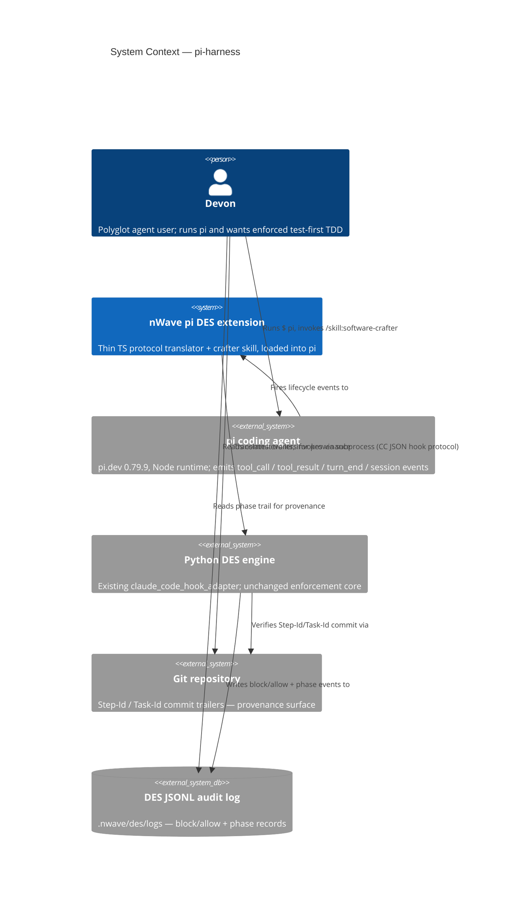
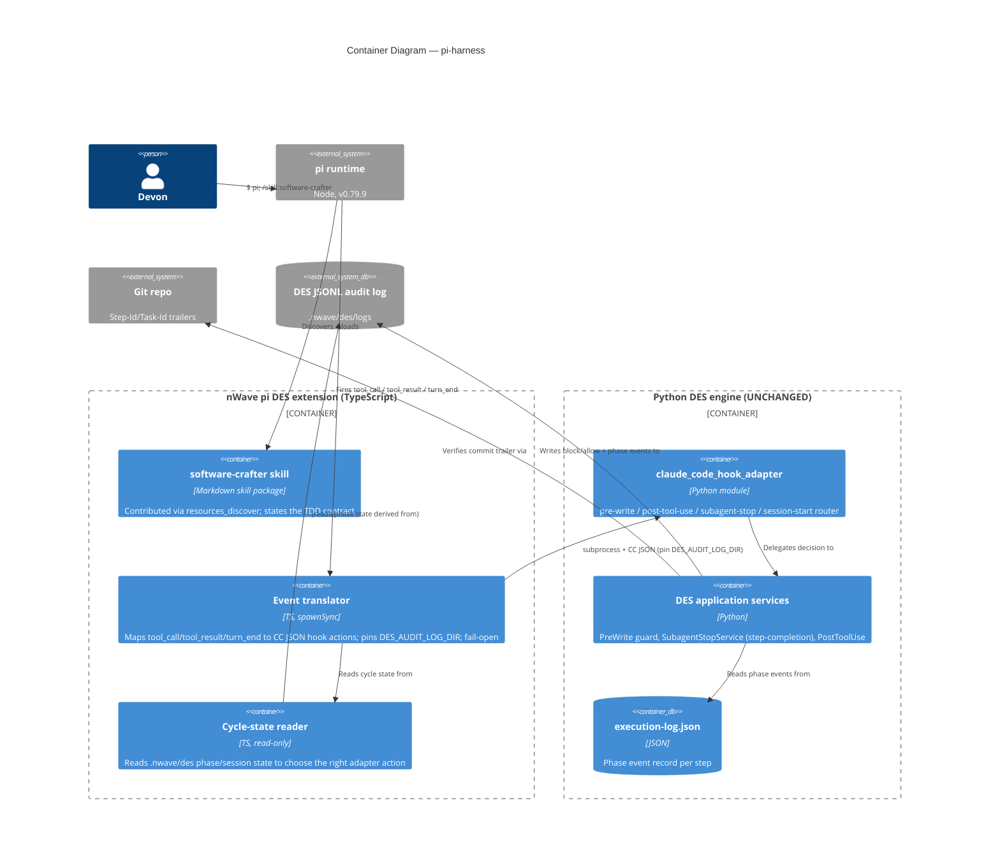

# Architecture Brief

> Single Source of Truth (SSOT) for nWave architecture decisions.
> Sections are appended per-wave / per-feature by the responsible architect.

## Application Architecture

### Feature: pi-harness — nWave software-crafter TDD enforcement on the pi coding agent

> DESIGN wave output (nw-solution-architect, PROPOSE mode), 2026-06-23.
> Builds on DISCUSS (`docs/feature/pi-harness/feature-delta.md`, decisions D1–D7)
> and SPIKE-0 (`docs/feature/pi-harness/spike/findings.md`, VERDICT WORKS,
> design implications 1–7 binding). A walking skeleton is already committed
> (`nWave/templates/pi-des-extension.ts.template`); this design surrounds it.

#### System context and capabilities

pi-harness makes the nWave software-crafter available inside the **pi coding
agent** (pi.dev, v0.79.9, Node runtime) as a pi **skill** (`/skill:software-crafter`)
and forces it through canonical RED→GREEN→REFACTOR TDD, using the **existing
Python DES engine unchanged** (zero adapter fork, D5). pi is a minimal,
**subagent-less** harness; the central design problem is re-grounding DES's
step-completion validation — which in Claude Code fires on the `SubagentStop`
event — onto a cycle boundary that exists in pi.

The system reuses three existing DES verification surfaces (D3): the JSONL audit
log, git `Step-Id`/`Task-Id` commit trailers, and the execution-log phase event
record. The only new code is **protocol-translation TypeScript** in the pi
extension and an **installer plugin** mirroring the Codex/OpenCode precedent.

Quality attributes that drive this design (ISO 25010):
- **Functional suitability / correctness** — 100% of attempted step-skips blocked
  (KPI). The enforcement decision must be byte-identical to Claude Code's.
- **Maintainability (reusability)** — one canonical enforcement engine; the pi
  surface is a translator, not a fork. Sensitivity point: any divergence in the
  TS shim is a maintenance liability.
- **Portability (installability/replaceability)** — clean manifest-tracked
  install/uninstall, mirroring Codex/OpenCode.
- **Reliability (fault tolerance)** — fail-open on translator/subprocess errors
  (a translator bug must never block a legitimate edit), fail-closed only inside
  the Python engine where it already is.

#### C4 — Level 1: System Context

#### C4 — Level 2: Container

#### Component architecture and boundaries

The design adds **two artifacts** and keeps everything else as reuse:

1. **pi DES extension** (`nWave/templates/pi-des-extension.ts.template`, EXTEND
   the committed skeleton) — a thin TS translator. Its boundary: translate pi
   lifecycle events into Claude Code hook actions and relay the engine's
   allow/block verdict back to pi. It owns NO enforcement logic. New
   responsibilities over the skeleton: (a) the `tool_result`/`turn_end`
   subscriptions, (b) selecting the right adapter action from cycle state, (c)
   pinning `DES_AUDIT_LOG_DIR`.

2. **pi installer plugin** (`scripts/install/plugins/pi_des_plugin.py`, CREATE
   NEW from the `opencode_des_plugin.py` mould) — render template, install
   extension into pi config, register the skill, write
   `.nwave-des-manifest.json`, validate→install→verify→uninstall.

The crafter skill is **reused** from `nWave/skills` assets; how it is contributed
to pi is the D9 decision below.

#### Driving ports (inbound)

| Driving port | Surface | DES action invoked | Notes |
|--------------|---------|--------------------|-------|
| pi `tool_call` (write/edit) | pre-execute, can `{block:true,reason}` | `pre-write` | RED gate: block impl-before-failing-test. Already in skeleton for `write`/`edit`. |
| pi `tool_call` (bash running tests) | pre-execute | none (observe) | Used to detect a forthcoming test run; the result lands on `tool_result`. |
| pi `tool_result` (bash test run) | post-execute | `post-tool-use` (+ phase record via CLI) | Records suite red/green outcome; PostToolUse-analog notification injection. |
| pi `tool_call` (bash `git commit`) | pre-execute, can block | `subagent-stop` (step-completion analog) | **D6 headline**: validates the cycle at the commit boundary. |
| pi `turn_end` / `agent_end` | end-of-turn | reconcile (read-only) | Safety-net reconciliation; never the sole gate (see D6). |
| pi `session_start` | startup | `pre-write` sentinel self-probe | Health line + Earned-Trust startup probe (skeleton). |
| `/skill:software-crafter` | user command | n/a | Loads crafter persona; states the TDD contract. |
| nWave installer pi target | `nwave install` | n/a | Registers extension + skill + DES wiring. |

#### Driven ports / adapters (outbound, all REUSED unchanged)

| Driven port (Python) | Adapter | Reuse |
|----------------------|---------|-------|
| Hook protocol entry | `claude_code_hook_adapter` (`pre-write`/`post-tool-use`/`subagent-stop`/`session-start`) | UNCHANGED |
| `CommitVerifier` | `GitCommitVerifier` (Step-Id + Task-Id `--all-match`) | UNCHANGED |
| `ExecutionLogReader` | execution-log.json phase events | UNCHANGED |
| `AuditLogWriter` | `JsonlAuditLogWriter` (dir pinned via `DES_AUDIT_LOG_DIR`) | UNCHANGED |
| Activation | `.nwave/local-config.json:{enabled_for_repo:true}` | UNCHANGED |
| Interpreter / lib resolution | `resolve_python_command_for_spawn` / `resolve_des_lib_path_for_spawn` | REUSED in plugin |

#### D6 — Step-completion / cycle-boundary enforcement model (headline decision)

**Recommendation: Option C — Hybrid (tool_call within-cycle ordering + commit-boundary step-completion), with a turn_end reconciliation safety net.**

The pivotal observation: DES's `SubagentStopService.validate()` is **not coupled
to the subagent mechanism**. It is a pure validation over
`(execution_log_path, project_id, step_id, cwd)` — it reads the execution-log
phase events (`StepCompletionValidator`) and verifies a git commit carrying
`Step-Id: {step}` AND `Task-Id: {feature}` (`GitCommitVerifier`). The subagent
boundary in Claude Code is merely the **trigger cadence**. pi gives us an
equivalent natural cadence: **the `git commit` tool call** is the moment a step
claims completion. So we trigger the existing `subagent-stop` action there.

Mechanism mapping for the three concerns:
- **"no impl before a failing test" (RED)** — pi `tool_call` for `write`/`edit`
  on a production path → existing `pre-write` guard. (Already proven in SPIKE-0
  and the skeleton.)
- **"failing test exists / suite is green / regression"** — observed at the
  `tool_result` of the bash **test-run** tool. The translator records the
  pass/fail outcome as a phase event via the existing DES phase-logging CLI
  (`des-log-phase`), exactly as Claude Code crafter sessions do. No new log
  format (D3).
- **"step completed correctly"** — at the `git commit` `tool_call`, the
  translator invokes the `subagent-stop` action, which runs the **unchanged**
  `SubagentStopService`: validates phase completeness from the execution-log and
  verifies the Step-Id/Task-Id commit. A failing validation returns
  `{block:true,reason}` so pi aborts the commit.
- **turn_end / agent_end** — a read-only reconciliation pass that flags an
  abandoned cycle (e.g. session ended mid-RED). It never blocks (pi may not
  honor a block at turn end and a missed turn-end must not strand the user); it
  is a safety net, not the gate.

Cycle state lives in the existing `.nwave/des/` session area (the same
`deliver-session.json` / phase-signal mechanism Claude Code uses), keyed by
project/step. The translator only **reads** state to choose the action; the
Python engine remains the sole writer of authoritative phase records.

This honors zero-fork (D5), reuses all verification surfaces (D3), and delivers
full RED→GREEN→REFACTOR gating (D2). See ADR-PI-001 for the rejected
alternatives.

#### Activation + audit-dir wiring (first-class concern, SPIKE implication 2 & 3)

- **Activation**: every adapter invocation is dormant (exit 0 / allow) unless
  `.nwave/local-config.json:{enabled_for_repo:true}` resolves active. The
  extension does not re-implement activation; the Python `activation_gate`
  already gates every action. The extension simply runs the project cwd.
- **Audit dir**: the extension MUST set `DES_AUDIT_LOG_DIR` to the project's
  `.nwave/des/logs` on every spawn, because `JsonlAuditLogWriter` defaults to
  the process cwd. This is mandatory, not optional (SPIKE implication 3).

#### Contract shape classification (Principle 12 — Effect Isolation by Design)

Every component classified by contract shape, universe, and the assertion
mechanism the crafter will use. The architecture makes the bug class "translator
silently writes / decides" structurally hard: the extension is a pure relay.

| Component | Contract shape | Universe | Assertion mechanism |
|-----------|----------------|----------|---------------------|
| pi event translator (TS) | **pure-function** (pi event + cycle state → `Decision{allow \| block, reason}`); only effects are stderr logging + process exit code + the DES subprocess spawn (delegated effect) | reads: cycle-state files (read-only), pi event payload. writes: none of its own | thin-translator test: AST/string assertion that no allow/block decision literal exists beyond relaying engine exit-code-2 + `reason`; LoC budget ≈150 for the full gate set |
| cycle-state reader (TS) | **pure-function** (`.nwave/des` state → action enum) | reads: `.nwave/des/*` session/phase state. writes: none | unit assertion: returns an action enum, performs no writes |
| `claude_code_hook_adapter` + DES services (Python) | **unbounded-preservation** (reads three verification surfaces, writes phase/audit records; must remain the sole authoritative writer) | reads: `execution-log.json`, git history, `.nwave/local-config.json`; writes: JSONL audit log, phase records, (integrity-corrected) execution-log | UNCHANGED — existing DES test suite owns these contracts; pi adds no new writer |
| pi installer plugin (Python) | **bounded-change** (declared mutation set: rendered extension file, crafter skill file, `.nwave-des-manifest.json`) | writes: pi config dir (extension + skill + manifest) only | manifest reconciliation test (install→verify→uninstall removes exactly the declared set) |

The driving "translator" port exposes no write capability of its own — it relays
a verdict. The only authoritative writer remains the Python engine (single
source of truth for phase/audit state), so "a preview/observe path silently
writes" is non-representable in the pi surface.

#### Out-of-harness commit boundary (trust-boundary note)

A `git commit` made **outside** pi (e.g. directly in the terminal) bypasses the
live `tool_call` step-completion gate. This is by design: the trust boundary for
provenance is **git** (Step-Id/Task-Id trailers) + the JSONL audit log, not the
pi runtime. Out-of-harness commits are caught post-hoc by the same
`GitCommitVerifier`/`StepCompletionValidator` run in CI. The live pi gate is a
fast-feedback convenience; the durable guarantee is the commit-trailer +
audit-log provenance (KPI: 0 out-of-order phase transitions, parsed from those
surfaces).

#### Technology choices

| Choice | Version / License | Rationale |
|--------|-------------------|-----------|
| pi coding agent | 0.79.9 (`@earendil-works/pi-coding-agent`) | Target harness; pinned by SPIKE-0. |
| Node runtime + TypeScript | pi-bundled | pi extensions are TS/Node; `spawnSync` proven in SPIKE. |
| Python DES engine | existing, unchanged | Zero fork (D5); one canonical enforcement core. |
| Installer plugin | Python (project standard) | Mirrors Codex/OpenCode plugins; OOP paradigm (project-wide). |

No new third-party dependencies. No external network integrations → **no contract
tests required** for this feature (the only "external" surface is pi itself,
exercised by the model-free acceptance test from SPIKE-0).

#### Architectural enforcement tooling

- The zero-fork invariant (KPI: 0 edits to `des.adapters.drivers.hooks.*`) is
  enforceable by a CI guard diffing the DES adapter tree (an existing concern in
  the repo's release contract tests). Recommend a test asserting the pi extension
  imports/invokes only the published `claude_code_hook_adapter` actions and
  defines no enforcement branches of its own.
- The "translator stays thin" rule (it must contain no allow/block decision
  beyond relaying exit code 2) is checkable by an AST/string assertion in the
  pi-extension test that no decision literal other than relaying `reason` exists.

#### Risks

- **R1 (medium): pi extension settings location unconfirmed.** The plugin assumes
  pi loads extensions from a config dir or settings registration. Flagged for a
  DEVOPS/verify check (see Open Questions). Mitigation: the install path is the
  only unknown; the runtime mechanism is SPIKE-proven via `-e <file>`. The
  plugin MUST emit a **non-fatal warning** when the pi config dir is not found at
  the assumed location (e.g. "pi extension install skipped — config dir not
  found; DES gating inactive for pi") rather than skipping silently, so an
  install that fails to wire pi is visible to the user (fail-open but observable).
- **R3a (low): cold-start latency budget.** Acceptance criterion: the `pre-write`
  round-trip (resolve interpreter → spawn adapter → parse JSON) completes in
  **<1s** on a typical dev machine, within pi's `tool_call` handler timeout (the
  extension already sets a 5s `spawnSync` timeout). Confirm pi 0.79.9's handler
  timeout during DELIVER. SPIKE observed sub-second interactively.
- **R2 (low — downgraded by SPIKE-1): commit/test-run interception via the `bash`
  tool.** SPIKE-1 (`spike/findings-spike-1-driving-ports.md`) confirmed from pi
  0.79.9 type declarations that the `bash` `tool_call` is the same blockable event
  class proven for `write`, that `BashToolInput.command` is inspectable (distinguish
  `git commit` from a test run), and that the bash `tool_result` carries
  `exitCode`. D6 gates on the commit `bash` `tool_call`; `turn_end`/`agent_end` is
  non-blocking reconciliation only. Residual: live model-driven bash-block exercised
  by the `@requires_external` DELIVER scenario.
- **R4 (low): live model e2e needs a backend** (SPIKE CI caveat). Mitigation:
  model-free acceptance tests + optional gated manual e2e.
