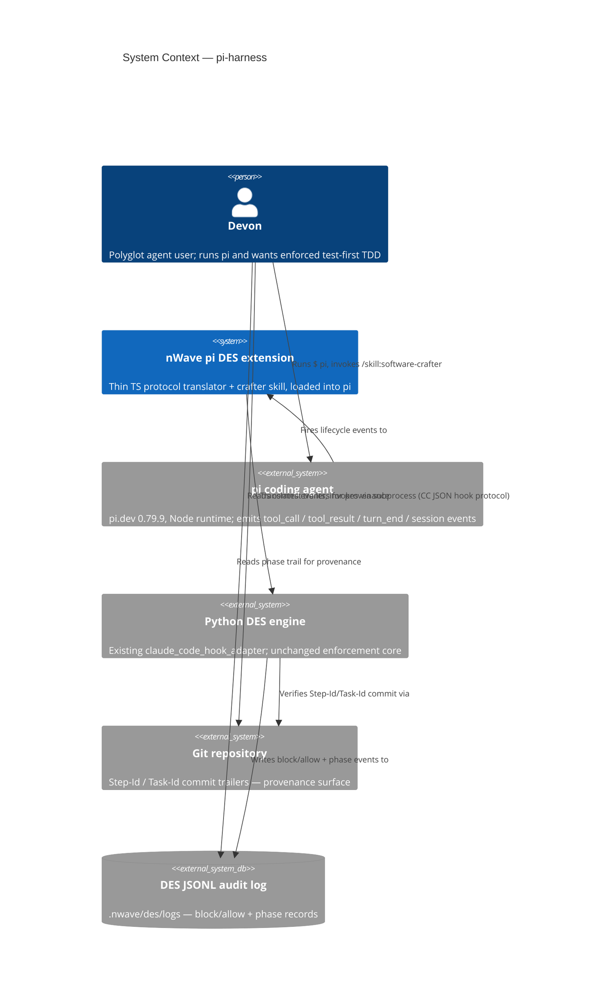
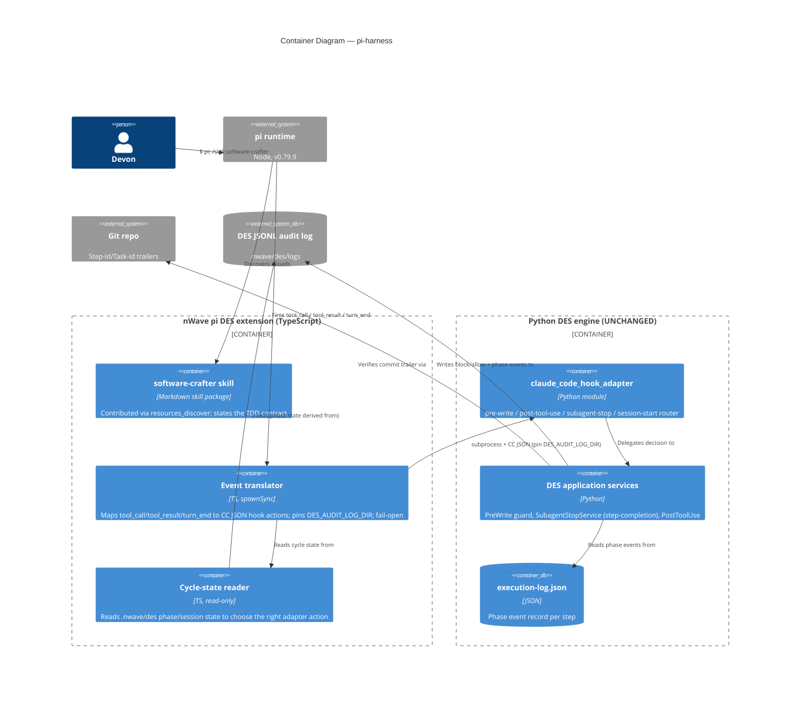
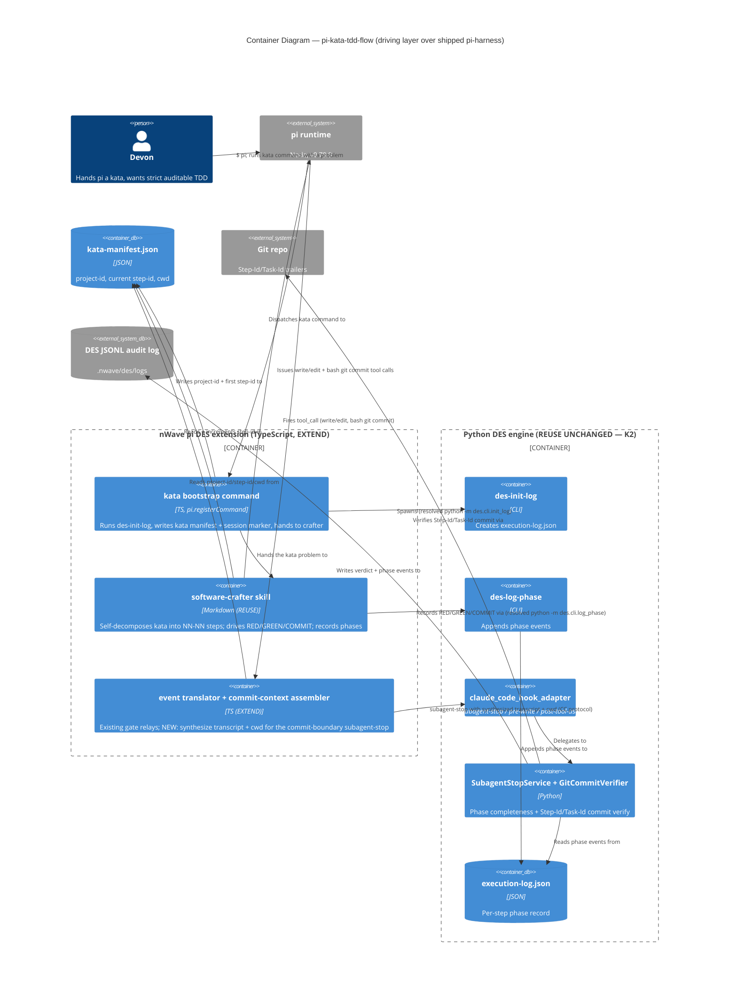

# Architecture Brief

> Single Source of Truth (SSOT) for nWave architecture decisions.
> Sections are appended per-wave / per-feature by the responsible architect.

## Application Architecture

### Feature: pi-harness — nWave software-crafter TDD enforcement on the pi coding agent

> DESIGN wave output (nw-solution-architect, PROPOSE mode), 2026-06-23.
> Builds on DISCUSS (`docs/feature/pi-harness/feature-delta.md`, decisions D1–D7)
> and SPIKE-0 (`docs/feature/pi-harness/spike/findings.md`, VERDICT WORKS,
> design implications 1–7 binding). A walking skeleton is already committed
> (`nWave/templates/pi-des-extension.ts.template`); this design surrounds it.

#### System context and capabilities

pi-harness makes the nWave software-crafter available inside the **pi coding
agent** (pi.dev, v0.79.9, Node runtime) as a pi **skill** (`/skill:software-crafter`)
and forces it through canonical RED→GREEN→REFACTOR TDD, using the **existing
Python DES engine unchanged** (zero adapter fork, D5). pi is a minimal,
**subagent-less** harness; the central design problem is re-grounding DES's
step-completion validation — which in Claude Code fires on the `SubagentStop`
event — onto a cycle boundary that exists in pi.

The system reuses three existing DES verification surfaces (D3): the JSONL audit
log, git `Step-Id`/`Task-Id` commit trailers, and the execution-log phase event
record. The only new code is **protocol-translation TypeScript** in the pi
extension and an **installer plugin** mirroring the Codex/OpenCode precedent.

Quality attributes that drive this design (ISO 25010):
- **Functional suitability / correctness** — 100% of attempted step-skips blocked
  (KPI). The enforcement decision must be byte-identical to Claude Code's.
- **Maintainability (reusability)** — one canonical enforcement engine; the pi
  surface is a translator, not a fork. Sensitivity point: any divergence in the
  TS shim is a maintenance liability.
- **Portability (installability/replaceability)** — clean manifest-tracked
  install/uninstall, mirroring Codex/OpenCode.
- **Reliability (fault tolerance)** — fail-open on translator/subprocess errors
  (a translator bug must never block a legitimate edit), fail-closed only inside
  the Python engine where it already is.

#### C4 — Level 1: System Context



#### C4 — Level 2: Container



#### Component architecture and boundaries

The design adds **two artifacts** and keeps everything else as reuse:

1. **pi DES extension** (`nWave/templates/pi-des-extension.ts.template`, EXTEND
   the committed skeleton) — a thin TS translator. Its boundary: translate pi
   lifecycle events into Claude Code hook actions and relay the engine's
   allow/block verdict back to pi. It owns NO enforcement logic. New
   responsibilities over the skeleton: (a) the `tool_result`/`turn_end`
   subscriptions, (b) selecting the right adapter action from cycle state, (c)
   pinning `DES_AUDIT_LOG_DIR`.

2. **pi installer plugin** (`scripts/install/plugins/pi_des_plugin.py`, CREATE
   NEW from the `opencode_des_plugin.py` mould) — render template, install
   extension into pi config, register the skill, write
   `.nwave-des-manifest.json`, validate→install→verify→uninstall.

The crafter skill is **reused** from `nWave/skills` assets; how it is contributed
to pi is the D9 decision below.

#### Driving ports (inbound)

| Driving port | Surface | DES action invoked | Notes |
|--------------|---------|--------------------|-------|
| pi `tool_call` (write/edit) | pre-execute, can `{block:true,reason}` | `pre-write` | RED gate: block impl-before-failing-test. Already in skeleton for `write`/`edit`. |
| pi `tool_call` (bash running tests) | pre-execute | none (observe) | Used to detect a forthcoming test run; the result lands on `tool_result`. |
| pi `tool_result` (bash test run) | post-execute | `post-tool-use` (+ phase record via CLI) | Records suite red/green outcome; PostToolUse-analog notification injection. |
| pi `tool_call` (bash `git commit`) | pre-execute, can block | `subagent-stop` (step-completion analog) | **D6 headline**: validates the cycle at the commit boundary. |
| pi `turn_end` / `agent_end` | end-of-turn | reconcile (read-only) | Safety-net reconciliation; never the sole gate (see D6). |
| pi `session_start` | startup | `pre-write` sentinel self-probe | Health line + Earned-Trust startup probe (skeleton). |
| `/skill:software-crafter` | user command | n/a | Loads crafter persona; states the TDD contract. |
| nWave installer pi target | `nwave install` | n/a | Registers extension + skill + DES wiring. |

#### Driven ports / adapters (outbound, all REUSED unchanged)

| Driven port (Python) | Adapter | Reuse |
|----------------------|---------|-------|
| Hook protocol entry | `claude_code_hook_adapter` (`pre-write`/`post-tool-use`/`subagent-stop`/`session-start`) | UNCHANGED |
| `CommitVerifier` | `GitCommitVerifier` (Step-Id + Task-Id `--all-match`) | UNCHANGED |
| `ExecutionLogReader` | execution-log.json phase events | UNCHANGED |
| `AuditLogWriter` | `JsonlAuditLogWriter` (dir pinned via `DES_AUDIT_LOG_DIR`) | UNCHANGED |
| Activation | `.nwave/local-config.json:{enabled_for_repo:true}` | UNCHANGED |
| Interpreter / lib resolution | `resolve_python_command_for_spawn` / `resolve_des_lib_path_for_spawn` | REUSED in plugin |

#### D6 — Step-completion / cycle-boundary enforcement model (headline decision)

**Recommendation: Option C — Hybrid (tool_call within-cycle ordering + commit-boundary step-completion), with a turn_end reconciliation safety net.**

The pivotal observation: DES's `SubagentStopService.validate()` is **not coupled
to the subagent mechanism**. It is a pure validation over
`(execution_log_path, project_id, step_id, cwd)` — it reads the execution-log
phase events (`StepCompletionValidator`) and verifies a git commit carrying
`Step-Id: {step}` AND `Task-Id: {feature}` (`GitCommitVerifier`). The subagent
boundary in Claude Code is merely the **trigger cadence**. pi gives us an
equivalent natural cadence: **the `git commit` tool call** is the moment a step
claims completion. So we trigger the existing `subagent-stop` action there.

Mechanism mapping for the three concerns:
- **"no impl before a failing test" (RED)** — pi `tool_call` for `write`/`edit`
  on a production path → existing `pre-write` guard. (Already proven in SPIKE-0
  and the skeleton.)
- **"failing test exists / suite is green / regression"** — observed at the
  `tool_result` of the bash **test-run** tool. The translator records the
  pass/fail outcome as a phase event via the existing DES phase-logging CLI
  (`des-log-phase`), exactly as Claude Code crafter sessions do. No new log
  format (D3).
- **"step completed correctly"** — at the `git commit` `tool_call`, the
  translator invokes the `subagent-stop` action, which runs the **unchanged**
  `SubagentStopService`: validates phase completeness from the execution-log and
  verifies the Step-Id/Task-Id commit. A failing validation returns
  `{block:true,reason}` so pi aborts the commit.
- **turn_end / agent_end** — a read-only reconciliation pass that flags an
  abandoned cycle (e.g. session ended mid-RED). It never blocks (pi may not
  honor a block at turn end and a missed turn-end must not strand the user); it
  is a safety net, not the gate.

Cycle state lives in the existing `.nwave/des/` session area (the same
`deliver-session.json` / phase-signal mechanism Claude Code uses), keyed by
project/step. The translator only **reads** state to choose the action; the
Python engine remains the sole writer of authoritative phase records.

This honors zero-fork (D5), reuses all verification surfaces (D3), and delivers
full RED→GREEN→REFACTOR gating (D2). See ADR-PI-001 for the rejected
alternatives.

#### Activation + audit-dir wiring (first-class concern, SPIKE implication 2 & 3)

- **Activation**: every adapter invocation is dormant (exit 0 / allow) unless
  `.nwave/local-config.json:{enabled_for_repo:true}` resolves active. The
  extension does not re-implement activation; the Python `activation_gate`
  already gates every action. The extension simply runs the project cwd.
- **Audit dir**: the extension MUST set `DES_AUDIT_LOG_DIR` to the project's
  `.nwave/des/logs` on every spawn, because `JsonlAuditLogWriter` defaults to
  the process cwd. This is mandatory, not optional (SPIKE implication 3).

#### Contract shape classification (Principle 12 — Effect Isolation by Design)

Every component classified by contract shape, universe, and the assertion
mechanism the crafter will use. The architecture makes the bug class "translator
silently writes / decides" structurally hard: the extension is a pure relay.

| Component | Contract shape | Universe | Assertion mechanism |
|-----------|----------------|----------|---------------------|
| pi event translator (TS) | **pure-function** (pi event + cycle state → `Decision{allow \| block, reason}`); only effects are stderr logging + process exit code + the DES subprocess spawn (delegated effect) | reads: cycle-state files (read-only), pi event payload. writes: none of its own | thin-translator test: AST/string assertion that no allow/block decision literal exists beyond relaying engine exit-code-2 + `reason`; LoC budget ≈150 for the full gate set |
| cycle-state reader (TS) | **pure-function** (`.nwave/des` state → action enum) | reads: `.nwave/des/*` session/phase state. writes: none | unit assertion: returns an action enum, performs no writes |
| `claude_code_hook_adapter` + DES services (Python) | **unbounded-preservation** (reads three verification surfaces, writes phase/audit records; must remain the sole authoritative writer) | reads: `execution-log.json`, git history, `.nwave/local-config.json`; writes: JSONL audit log, phase records, (integrity-corrected) execution-log | UNCHANGED — existing DES test suite owns these contracts; pi adds no new writer |
| pi installer plugin (Python) | **bounded-change** (declared mutation set: rendered extension file, crafter skill file, `.nwave-des-manifest.json`) | writes: pi config dir (extension + skill + manifest) only | manifest reconciliation test (install→verify→uninstall removes exactly the declared set) |

The driving "translator" port exposes no write capability of its own — it relays
a verdict. The only authoritative writer remains the Python engine (single
source of truth for phase/audit state), so "a preview/observe path silently
writes" is non-representable in the pi surface.

#### Out-of-harness commit boundary (trust-boundary note)

A `git commit` made **outside** pi (e.g. directly in the terminal) bypasses the
live `tool_call` step-completion gate. This is by design: the trust boundary for
provenance is **git** (Step-Id/Task-Id trailers) + the JSONL audit log, not the
pi runtime. Out-of-harness commits are caught post-hoc by the same
`GitCommitVerifier`/`StepCompletionValidator` run in CI. The live pi gate is a
fast-feedback convenience; the durable guarantee is the commit-trailer +
audit-log provenance (KPI: 0 out-of-order phase transitions, parsed from those
surfaces).

#### Technology choices

| Choice | Version / License | Rationale |
|--------|-------------------|-----------|
| pi coding agent | 0.79.9 (`@earendil-works/pi-coding-agent`) | Target harness; pinned by SPIKE-0. |
| Node runtime + TypeScript | pi-bundled | pi extensions are TS/Node; `spawnSync` proven in SPIKE. |
| Python DES engine | existing, unchanged | Zero fork (D5); one canonical enforcement core. |
| Installer plugin | Python (project standard) | Mirrors Codex/OpenCode plugins; OOP paradigm (project-wide). |

No new third-party dependencies. No external network integrations → **no contract
tests required** for this feature (the only "external" surface is pi itself,
exercised by the model-free acceptance test from SPIKE-0).

#### Architectural enforcement tooling

- The zero-fork invariant (KPI: 0 edits to `des.adapters.drivers.hooks.*`) is
  enforceable by a CI guard diffing the DES adapter tree (an existing concern in
  the repo's release contract tests). Recommend a test asserting the pi extension
  imports/invokes only the published `claude_code_hook_adapter` actions and
  defines no enforcement branches of its own.
- The "translator stays thin" rule (it must contain no allow/block decision
  beyond relaying exit code 2) is checkable by an AST/string assertion in the
  pi-extension test that no decision literal other than relaying `reason` exists.

#### Risks

- **R1 (medium): pi extension settings location unconfirmed.** The plugin assumes
  pi loads extensions from a config dir or settings registration. Flagged for a
  DEVOPS/verify check (see Open Questions). Mitigation: the install path is the
  only unknown; the runtime mechanism is SPIKE-proven via `-e <file>`. The
  plugin MUST emit a **non-fatal warning** when the pi config dir is not found at
  the assumed location (e.g. "pi extension install skipped — config dir not
  found; DES gating inactive for pi") rather than skipping silently, so an
  install that fails to wire pi is visible to the user (fail-open but observable).
- **R3a (low): cold-start latency budget.** Acceptance criterion: the `pre-write`
  round-trip (resolve interpreter → spawn adapter → parse JSON) completes in
  **<1s** on a typical dev machine, within pi's `tool_call` handler timeout (the
  extension already sets a 5s `spawnSync` timeout). Confirm pi 0.79.9's handler
  timeout during DELIVER. SPIKE observed sub-second interactively.
- **R2 (low — downgraded by SPIKE-1): commit/test-run interception via the `bash`
  tool.** SPIKE-1 (`spike/findings-spike-1-driving-ports.md`) confirmed from pi
  0.79.9 type declarations that the `bash` `tool_call` is the same blockable event
  class proven for `write`, that `BashToolInput.command` is inspectable (distinguish
  `git commit` from a test run), and that the bash `tool_result` carries
  `exitCode`. D6 gates on the commit `bash` `tool_call`; `turn_end`/`agent_end` is
  non-blocking reconciliation only. Residual: live model-driven bash-block exercised
  by the `@requires_external` DELIVER scenario.
- **R4 (low): live model e2e needs a backend** (SPIKE CI caveat). Mitigation:
  model-free acceptance tests + optional gated manual e2e.

### Feature: pi-kata-tdd-flow — self-driven nWave DELIVER TDD cycle for a kata in pi

> DESIGN wave output (nw-solution-architect, PROPOSE mode), 2026-06-24.
> Builds on the shipped pi-harness (`## Application Architecture` above,
> ADR-PI-001/002/003) and DISCUSS (`docs/feature/pi-kata-tdd-flow/feature-delta.md`,
> K1–K4 LOCKED). Headline ADR: `adr-pkt-001-kata-driving-and-commit-context.md`.
> Decisions: `docs/feature/pi-kata-tdd-flow/design/wave-decisions.md`.

#### System context and capabilities

pi-harness shipped the *verification* layer (extension relays pi events to the
unchanged Python DES engine; commit gate verifies). pi-kata-tdd-flow adds the
*driving* layer so a **single pi agent** — no orchestrator, no subagents, no
`/nw-deliver` — self-runs the DELIVER TDD cycle for a code kata: bootstrap a
DES-tracked session, drive one-tiny-test-at-a-time RED→GREEN→COMMIT, record each
phase via `des-log-phase`, and let the SHIPPED commit gate verify. This closes
the original pi-harness DoD (the live-model kata, DoD item 9).

Decisive engine fact: the shipped pi `subagent-stop` spawn supplies neither the
engine's *direct* nor its *Claude Code* protocol context, so the commit gate
currently **always allows**. This feature is the layer that activates it, using
the Claude Code protocol (a synthesized transcript carrying DES markers + `cwd`)
because the direct protocol returns `effective_cwd=""` and the service guards
commit verification behind `if context.cwd` — enabling it on the direct path
would be an `src/des/**` change (K2 violation). See ADR-PKT-001 D-PKT-4.

Quality attributes (ISO 25010):
- **Functional correctness** — 100% of kata steps record RED→GREEN→COMMIT;
  incomplete-step commits blocked at the boundary (KPIs). The gate must use the
  same `GitCommitVerifier` + `StepCompletionValidator` as Claude Code.
- **Reliability** — the single agent must self-bootstrap without an orchestrator;
  bootstrap is made deterministic via a registered command (R-PKT-1).
- **Maintainability (reusability)** — zero `src/des/**` change (K2); the new
  surface is command + recording instructions inside the already-shipped
  extension + reused crafter skill.

#### C4 — Level 2: Container (kata driving layer over the shipped harness)



#### Component — kata cycle sequence (bootstrap → per-step record → commit-gate verify)

```mermaid
sequenceDiagram
  actor Devon
  participant Cmd as kata command (TS, EXTEND)
  participant Skill as crafter skill (REUSE)
  participant Init as des-init-log (REUSE)
  participant Log as des-log-phase (REUSE)
  participant Tr as translator (EXTEND)
  participant Eng as subagent-stop + GitCommitVerifier (REUSE)

  Devon->>Cmd: kata "implement FizzBuzz via strict TDD"
  Cmd->>Init: python -m des.cli.init_log --project-dir docs/feature/fizzbuzz/deliver --feature-id fizzbuzz
  Cmd->>Cmd: write kata-manifest.json {project_id:fizzbuzz, step:01-01, cwd}
  Cmd->>Skill: hand kata problem + manifest
  loop one tiny test per step (NN-NN)
    Skill->>Skill: RED — write failing test (write tool_call → pre-write gate)
    Skill->>Log: log-phase --step-id 01-0N --phase RED --status EXECUTED --data FAIL
    Skill->>Skill: GREEN — minimal impl; suite green (test-run tool_result → post-tool-use)
    Skill->>Log: log-phase --step-id 01-0N --phase GREEN --status EXECUTED --data PASS
    Skill->>Skill: git commit (Step-Id + Task-Id trailers) via bash tool_call
    Tr->>Tr: read manifest; synthesize transcript w/ DES markers + cwd
    Tr->>Eng: subagent-stop (CC protocol: agent_transcript_path + cwd)
    alt phases complete AND commit verified
      Eng-->>Tr: allow → commit proceeds
      Skill->>Log: log-phase --step-id 01-0N --phase COMMIT --status EXECUTED --data PASS
      Skill->>Skill: increment manifest step-id → 01-0(N+1)
    else incomplete / unverified
      Eng-->>Tr: block (COMMIT_NOT_VERIFIED / phase gap)
      Tr-->>Skill: commit aborted — fix and retry
    end
  end
```

#### Reuse Analysis (HARD GATE)

| Overlapping component | Path | Verdict | Justification |
|-----------------------|------|---------|---------------|
| pi DES extension | `nWave/templates/pi-des-extension.ts.template` | **EXTEND** | Add a `registerCommand` bootstrap handler + commit-context (synthesized transcript + cwd) assembly. Stays a pure relay; no allow/block decision of its own. |
| pi installer plugin | `scripts/install/plugins/pi_des_plugin.py` | **EXTEND** | Render the resolved python/PYTHONPATH into the bootstrap+recording commands; register the kata command surface. Declared-mutation set unchanged in kind. |
| crafter skill | `nWave/skills` assets (+ pi-runnable cycle/recording variant) | **EXTEND (ADD)** | Add a pi-runnable cycle+recording section (self-decompose to NN-NN, call `des-log-phase` per phase). Canonical crafter content reused (ADR-PI-003). |
| `des-init-log` | `src/des/cli/init_log.py` | **REUSE-UNCHANGED** | Standalone CLI over `--project-dir/--feature-id`; classic-mode default fits a kata. |
| `des-log-phase` | `src/des/cli/log_phase.py` | **REUSE-UNCHANGED** | Standalone phase-append CLI; 3-phase canon phase names. |
| subagent-stop gate | `src/des/adapters/drivers/hooks/subagent_stop_handler.py` | **REUSE-UNCHANGED** | Activated via its existing Claude Code protocol (transcript markers + cwd). No edit. |
| `SubagentStopService` + `StepCompletionValidator` | `src/des/application/...` | **REUSE-UNCHANGED** | Pure validation over `(elog, project, step, cwd)`. |
| `GitCommitVerifier` | `src/des/adapters/driven/git/git_commit_verifier.py` | **REUSE-UNCHANGED** | `Step-Id`+`Task-Id` `--all-match` in `cwd`. |
| `DesMarkerParser` | `src/des/domain/des_marker_parser.py` | **REUSE-UNCHANGED** | The four markers the synthesized transcript carries. |
| JSONL audit writer | `src/des/adapters/driven/logging/...` | **REUSE-UNCHANGED** | `DES_AUDIT_LOG_DIR` pinned (already in the shipped extension). |
| `install_paths` spawn resolvers | `scripts/shared/install_paths.py` | **REUSE** | Resolve python + DES lib path for the CLI/adapter spawns. |
| nw-execute OUTCOME_RECORDING template | `nWave/skills/nw-execute/SKILL.md` | **REUSE (as model)** | The `des-log-phase`-per-phase + DES-marker pattern adapted into the crafter's pi-runnable section. No file edit; pattern source. |
| /nw-deliver Phase-1 bootstrap | (Claude Code orchestration) | **REUSE (as model)** | `des-init-log` + session-marker bootstrap pattern adapted into the kata command. No file edit. |
| kata manifest | `docs/feature/{kata}/deliver/kata-manifest.json` | **CREATE-NEW** | Evidence: no existing artifact carries `(project-id, current step-id, cwd)` for a roadmap-free kata; it replaces `roadmap.json`'s context-supply role (which is out of scope). Smallest possible new surface. |

No CREATE-NEW beyond the manifest; everything else EXTEND or REUSE.

#### Component decomposition

| Component | Path | Change type |
|-----------|------|-------------|
| kata bootstrap command (`registerCommand`) | `nWave/templates/pi-des-extension.ts.template` | EXTEND |
| commit-context assembler (synth transcript + cwd) | `nWave/templates/pi-des-extension.ts.template` | EXTEND |
| crafter pi-runnable cycle+recording section | crafter skill asset | EXTEND (ADD) |
| plugin render of resolved python/PYTHONPATH + command registration | `scripts/install/plugins/pi_des_plugin.py` | EXTEND |
| kata manifest | `docs/feature/{kata}/deliver/kata-manifest.json` | CREATE-NEW |
| DES CLIs, gate, verifier, marker parser, audit writer, resolvers | `src/des/**`, `scripts/shared/install_paths.py` | REUSE (UNCHANGED) |

#### Driving ports (inbound)

| Driving port | Surface | DES action invoked | Notes |
|--------------|---------|--------------------|-------|
| pi kata command | `pi.registerCommand` handler | `des-init-log` (CLI) | Bootstraps session + manifest; hands to crafter. NEW behavior in shipped extension. |
| `/skill:software-crafter` | user command (REUSE) | `des-log-phase` per phase (CLI) | Drives the cycle, self-decomposes NN-NN, records phases. |
| pi `tool_call` (write/edit) | pre-execute, blockable | `pre-write` | RED gate — shipped, unchanged. |
| pi `tool_call` (bash `git commit`) | pre-execute, blockable | `subagent-stop` (CC protocol) | NOW supplied with synthesized transcript + cwd → activates the shipped gate. |
| pi `tool_result` (bash test-run) | post-execute | `post-tool-use` | Suite-state recording — shipped, unchanged. |
| pi `session_start` | startup | `pre-write` sentinel | Health line — shipped, unchanged. |

#### Driven ports / adapters (outbound, all REUSED unchanged)

| Driven port (Python) | Adapter | Reuse |
|----------------------|---------|-------|
| Execution-log init | `des.cli.init_log` (CLI entry) | UNCHANGED |
| Phase recording | `des.cli.log_phase` (CLI entry) | UNCHANGED |
| Hook protocol entry | `claude_code_hook_adapter` (`subagent-stop` / `pre-write` / `post-tool-use`) | UNCHANGED |
| Step completion | `SubagentStopService` + `StepCompletionValidator` | UNCHANGED |
| Commit verification | `GitCommitVerifier` (`Step-Id` + `Task-Id` `--all-match`) | UNCHANGED |
| DES marker parse | `DesMarkerParser` | UNCHANGED |
| Audit writer | `JsonlAuditLogWriter` (`DES_AUDIT_LOG_DIR` pinned) | UNCHANGED |
| Interpreter / lib resolution | `resolve_python_command_for_spawn` / `resolve_des_lib_path_for_spawn` | REUSED in plugin |

#### Contract shape classification (Principle 12)

| Component | Contract shape | Universe | Assertion mechanism |
|-----------|----------------|----------|---------------------|
| kata bootstrap command (TS) | **bounded-change** (declared mutation set: `execution-log.json` via `des-init-log`, `kata-manifest.json`, session marker) | writes: kata deliver dir only | idempotent-bootstrap test: re-run leaves the declared set, no other path mutated |
| commit-context assembler (TS) | **pure-function** (manifest + commit event → CC-protocol payload `{agent_transcript_path, cwd}`); only effect = temp transcript write (delegated input to engine) | reads: manifest, commit command. writes: a transient transcript file it owns | thin-translator test extended: still no allow/block literal beyond relaying the engine verdict |
| crafter pi-runnable section (md) | **bounded-change** (records phases via `des-log-phase`; increments manifest step-id) | writes: `execution-log.json` (append via CLI), manifest step-id | recording-order test: per step, RED→GREEN→COMMIT appear ordered in the log |
| DES CLIs + gate + verifier (Python) | **unbounded-preservation** | UNCHANGED — existing DES suite owns these | UNCHANGED (K2) |

The driving surface owns no write capability beyond the declared bootstrap +
phase-recording set; the engine remains the sole authoritative validator/writer,
so "a driving step silently decides allow/block" stays non-representable.

#### Technology choices

| Choice | Version / License | Rationale |
|--------|-------------------|-----------|
| pi coding agent | 0.79.9 (`@earendil-works/pi-coding-agent`) | Target harness; pinned by pi-harness. |
| Node + TypeScript | pi-bundled | Extension + `registerCommand` are TS; `spawnSync` proven. |
| Python DES CLIs (`des-init-log`, `des-log-phase`) + engine | existing, UNCHANGED | Zero engine change (K2); one canonical recording + verification core. |
| Kata manifest | JSON (stdlib) | Smallest roadmap-free context carrier. |

No new third-party dependencies. No external network integration → **no contract
tests** (the only "external" surface is pi itself + the SPIKE-probeable adapter
round-trip).

#### Risks

- **R-PKT-1 (medium): will a single agent reliably self-bootstrap + record without
  an orchestrator?** Mitigation: bootstrap is moved out of prose into the
  deterministic `registerCommand` (D-PKT-1); recording stays in the skill but
  the commit gate fails-closed if a step's phases are incomplete, so an
  under-recorded step cannot silently pass.
- **R-PKT-2 (medium → low after SPIKE): commit-context route correctness.** The
  synthesized-transcript + cwd activation of the shipped gate (D-PKT-4) is the
  one make-or-break unknown; model-free SPIKE-probeable. If it fails, the only
  alternative needs an `src/des/**` `cwd` add → escalate as a K2 upstream issue,
  do not design it.
- **R-PKT-3 (low): CLI reachability post-install.** Mitigated by reusing the
  install-time-resolved python + PYTHONPATH (same path the adapter spawn already
  uses); not the unconfirmed console-script-on-PATH.
- **R-PKT-4 (low): step-id resolution at the commit boundary.** The manifest is
  the single source; a stale/missing step-id surfaces as `COMMIT_NOT_VERIFIED`
  (engine fail-closed), which is safe.
- **R-PKT-5 (low): false gate positives across a multi-step kata.** Each commit
  carries `Step-Id`+`Task-Id`; `--all-match` prevents cross-step confusion;
  per-step manifest increment keeps the verified step aligned with the commit.
- **R-PKT-6 (low): live-model full kata needs a backend** (inherited DoD item 9,
  `@requires_external`).

#### Architectural enforcement tooling

- Zero-engine-change (K2) is enforceable by the existing CI guard diffing
  `src/des/**` / the DES adapter tree — extend it to assert this feature touches
  no `src/des/**` file.
- The thin-translator invariant (no allow/block decision beyond relaying the
  engine verdict) extends to the new commit-context assembler — the existing
  AST/string test on the extension must continue to find no decision literal.

#### Handoff (DESIGN → DISTILL)

C4 L1 inherited from pi-harness + L2 + sequence here; ADR-PKT-001 is the gate
spec. **No external integrations → no contract tests.** SPIKE on D-PKT-4
recommended before DELIVER. Open items: confirm pi `registerCommand` shape
(source inspection); manifest schema; standalone `des-log-phase` schema-loader
path; `@requires_external` live-model kata (DoD item 9).
